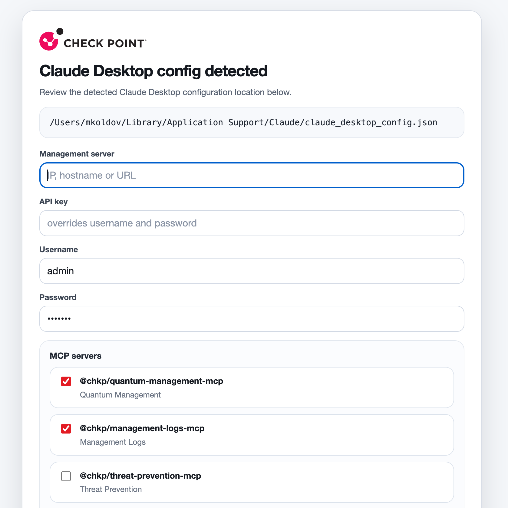
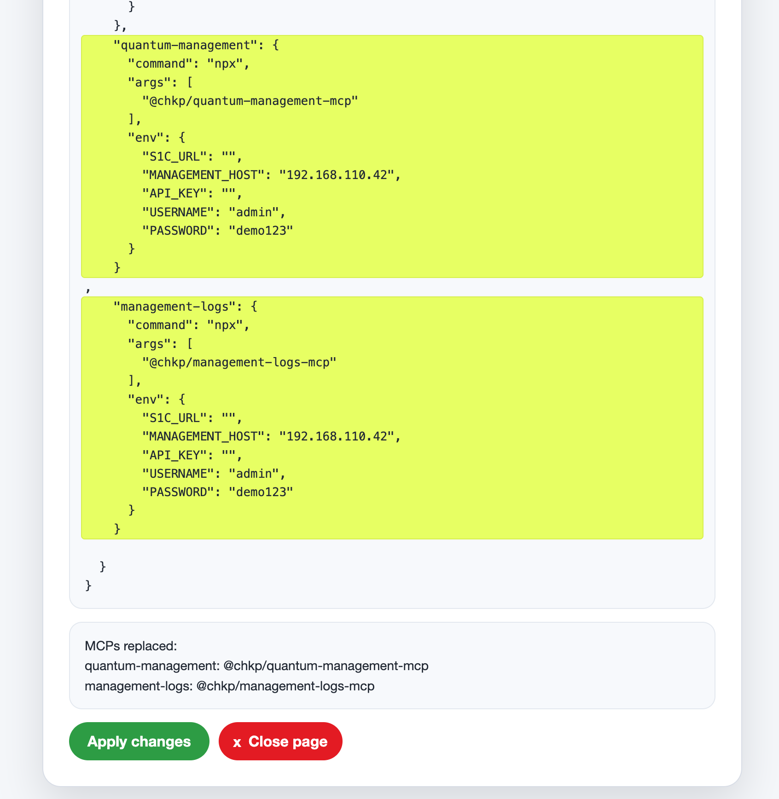

# cpmcp

Minimal CLI for previewing and applying Check Point MCP server entries into Claude Desktop configuration in demo environment.

***Warning**: This is a demo tool for local config file manipulation. It is not intended for production use and does not include any security measures. Use at your own risk.*




## Usage

Run directly from GitHub:

```sh
npx -y github:mkol5222/cpmcp
```

Run locally during development:

```sh
node bin/cpmcp.js
```

## Current flow

1. The CLI detects the Claude Desktop config path.
2. It starts a local HTTP server on `127.0.0.1` on a random high port between `11151` and `22259`.
3. It opens the default browser to a local dialog page.
4. You enter the management server and credentials, choose MCP servers, and click `OK` to preview the change.
5. The page shows the suggested merged `claude_desktop_config.json`, highlights MCP server sections that will be added or replaced, and lists which MCPs would be replaced.
6. Clicking `Apply changes` writes the backup file and the updated Claude Desktop config, then shows an applied summary with a restart reminder.

## Platform support

- macOS: `~/Library/Application Support/Claude/claude_desktop_config.json`
- Windows: `%APPDATA%\Claude\claude_desktop_config.json`

If no Claude Desktop config is found, the UI shows `no Claude Desktop installation detected` and apply is blocked.

## Browser UI behavior

- All UI resources are embedded in the generated HTML. No external images, fonts, scripts, or stylesheets are loaded.
- The form includes `Management server`, `API key`, `Username`, and `Password`.
- `Username` defaults to `admin`.
- `Password` defaults to `demo123`.
- The page includes MCP server options loaded from `data/cpmcps.json`.
- `@chkp/quantum-management-mcp` and `@chkp/management-logs-mcp` are selected by default.
- Hovering an MCP entry shows its description.

## Management server handling

- The management server input accepts a URL, hostname, or IP address.
- Invalid values are marked with a red border and disable the `OK` button.
- If pasted text contains a URL inside larger text, the first URL is extracted automatically.
- If the pasted URL includes a path below `/web_api`, it is normalized to end at `/web_api`.
- If no URL is found in pasted multiline text, the first non-empty line is used.

## Derived environment values

The preview and console output derive these values:

- `S1C_URL`
- `MANAGEMENT_HOST`
- `API_KEY`
- `USERNAME`
- `PASSWORD`

Rules:

- If `Management server` is a URL, it becomes `S1C_URL` and `MANAGEMENT_HOST` is empty.
- If `Management server` is a hostname or IP, it becomes `MANAGEMENT_HOST` and `S1C_URL` is empty.
- If `API key` is provided, `USERNAME` and `PASSWORD` are cleared.

## Config preview and apply behavior

- The tool reads the existing Claude Desktop config as the merge base.
- It computes a backup path next to the main config file:

```text
claude_desktop_config_cpmcp_beckup.json
```

- Selected Check Point MCP servers are merged into `mcpServers`.
- If an existing `mcpServers` entry already references the same `@chkp/...` npm package in its `args`, that section is replaced in place.
- The preview page lists replaced MCPs by section name and npm package under `MCPs replaced`.
- The config preview highlights added or replaced MCP sections with a bright yellow-green background.
- Clicking `Apply changes` writes the backup file first, then writes the merged `claude_desktop_config.json`.
- After apply, the page shows a summary and reminds you to restart Claude Desktop for the changes to take effect.

## Console output

After the browser flow finishes, the CLI prints:

- `CLAUDE_DESKTOP_CONFIG`
- `S1C_URL`
- `MANAGEMENT_HOST`
- `API_KEY`
- `USERNAME`
- `PASSWORD`
- `MCP_SERVERS`